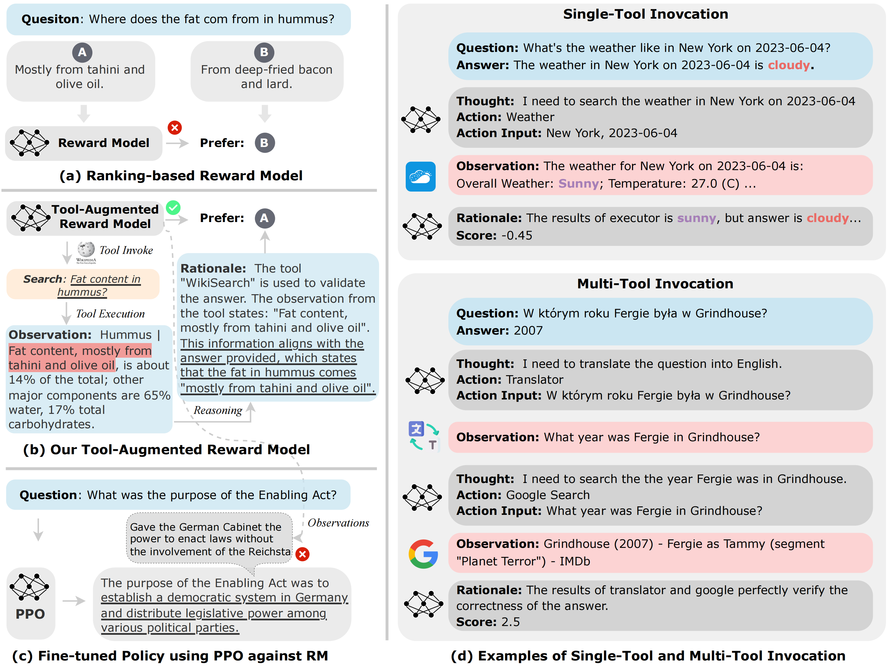

# [ICLR 2024 Spotlight | Tool-Augmented-Reward-Modeling](https://arxiv.org/abs/2310.01045)

   <a href="https://huggingface.co/baidu" target="_blank">
      
   </a>
  <a href="https://arxiv.org/abs/2310.01045" target="_blank">
      
   </a>
  <a href="https://iclr.cc/Conferences/2024" target="_blank">
      
   </a>


The official repository which contains the code and model checkpoints for our paper [Tool-Augmented Reward Modeling (ICLR 2024)](https://arxiv.org/pdf/2310.01045.pdf).


## 🔥 News
* **9 February, 2024:** 🎉 We release the official codebase and model weights of [`baidu/Themis-7b`](https://huggingface.co/baidu/Themis-7b). Stay tuned!🔥
* **16 January, 2024:** 🎉 Our work has been accepted to [ICLR 2024](https://iclr.cc/Conferences/2024) **Spotlight**! ✨

## 🗂️ Table of Contents

- [Tool-Augmented Reward Modeling](#tool-augmented-reward-modeling)
  - [🌟 Overview](#-overview)
  - [📌 Models](#-models)
  - [📕 Requirements](#-requirements)
  - [📚 Dataset](#-dataset)
    - [Data Instances](#data-instances)
    - [Data Fields](#data-fields)
  - [🚀 Training](#-training)
  - [🚁 Evaluation](#-evaluation)
  - [Citation](#citation)

## 🌟 Overview

<div align="center">
  
</div>

Reward modeling (a.k.a. preference modeling) is instrumental for aligning large language models with human preferences, particularly within the context of reinforcement learning from human feedback (RLHF). While conventional reward models (RMs) have exhibited remarkable scalability, they oft struggle with fundamental functionality such as arithmetic computation, code execution, and factual lookup. In this work, we propose a tool-augmented preference modeling approach, named Themis, to address these limitations by empowering RMs with access to external environments, including calculators and search engines. 
This approach not only fosters synergy between tool utilization and reward grading but also enhances interpretive capacity and scoring reliability.
Our study delves into the integration of external tools into RMs, enabling them to interact with diverse external sources and construct task-specific tool engagement and reasoning traces in an autoregressive manner. We validate our approach across a wide range of domains, incorporating seven distinct external tools. Our experimental results demonstrate a noteworthy overall improvement of 17.7% across eight tasks in preference ranking. Furthermore, our approach outperforms Gopher 280B by 7.3\% on TruthfulQA task in zero-shot evaluation. In human evaluations, RLHF trained with Themis attains an average win rate of 32\% when compared to baselines across four distinct tasks. Additionally, we provide a comprehensive collection of tool-related RM datasets, incorporating data from seven distinct tool APIs, totaling 15,000 instances. We anticipate that this publicly available dataset will facilitate and inspire further research advancements in the field.


## 📌 Models

We released our models on the HuggingFace Hub:

* [baidu/Themis-7b](https://huggingface.co/baidu/Themis-7b)


## 📕 Requirements

To run the code, you should install the dependency libraries.

```bash
pip install -r requirements.txt
```

## 📚 Dataset
TARA is a dataset for tool-augmented reward modeling, which includes comprehensive comparison data of human preferences and detailed tool invocation processes.

### Data Instances

An example of TARA looks as follows:

```text
{
  "id": "calendar_train_135", 
  "question": "Please let me know the day of the week that 2004-05-03 refers to.", 
  "pos_answer": 
      {
        "answer": "2004-05-03 is Monday", 
        "score": 1.0, 
        "actions": "Thought: I need to search what day of the week is 2004-05-03.\nAction: Calendar.week_day\nAction Input: 2004-05-03\nObservation: Monday", 
        "score_agent": 
            {
              "explanation": "The answer given, which states that the date 2004-05-03 is a Monday, aligns perfectly with the tool's execution result that also shows that the day was a Monday. This means that the provided answer is accurate and well-supported by the tool's findings.", 
              "score": "1.0"
            }
      }, 
  "neg_answer": 
      {
        "answer": "2004-05-03 is Friday", 
        "score": -1.0, 
        "actions": "Thought: I need to search what day of the week is 2004-05-03.\nAction: Calendar.week_day\nAction Input: 2004-05-03\nObservation: Monday", 
        "score_agent": 
            {
              "explanation": "The provided answer indicated that May 3, 2004, was a Friday, which contradicts the result of the Calendar tool that clearly specifies that the date in question was a Monday. The glaring difference between the two responses points to the fact that the given answer is wrong.", "score": "-1.0"
            }
      }
}
```

We put the TARA and the separate data for each tool under the `data/` folder.

### Data Fields
- `id`: the identifier of the instance
- `question`: the question to the model
- `pos_answer`: the answer that is more appropriate to the question
- `neg_answer`: the answer that is incorrect or suboptimal
- `answer`: the answer text
- `actions`: the tool actions to verify the answer
- `explanation`: the `Rationale` part that involves the aggregation and synthesis of previously acquired information

## 🚀 Training

### Train Themis
```bash
bash scripts/train_themis.sh
```

### Train RM (Vicuna)
```bash
bash scripts/train_rm.sh
```

### Train RM (Bert)

```bash
bash scripts/train_bert.sh
```

## 🚁 Evaluation

### Evaluate Themis
```bash
bash scripts/generate_themis.sh
```

### Evaluate RM (Vicuna) and RM (Bert)
```bash
bash scripts/generate_rm.sh
```


## Citation

For attribution in academic contexts, please cite this work as:

```
@inproceedings{tarm-2024-ernie,
  author = {Lei Li and
            Yekun Chai and
            Shuohuan Wang and
            Yu Sun and
            Hao Tian and
            Ningyu Zhang and
            Hua Wu},
  title = {Tool-Augmented Reward Modeling},
  booktitle = {The Twelfth International Conference on Learning Representations (ICLR)},
  year = {2024},
  url = {https://openreview.net/forum?id=d94x0gWTUX},
}
```
